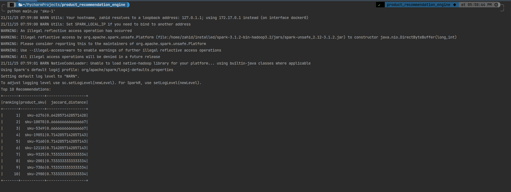
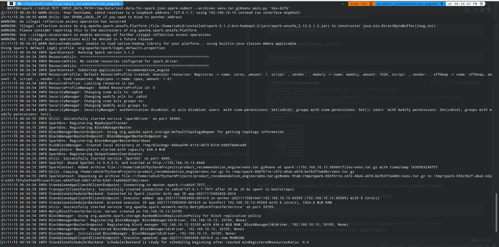
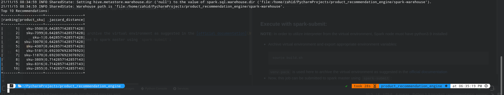

# Product Recommendation Engine

### Environment Details:
This code is developed and tested with Spark v3.1.2 using Python 3.9. But I have tested it with Python versions 3.8 and 3.6 as well.
## Usage:

First run `setup.sh` script. It will create a python virtual environment and will install the package dependencies.
```shell
chmod +x setup.sh
bash setup.sh
```
Once virtual environment has been created, you can run it in IDE/development environment or you can use it with spark-submit.

### Execute In Development Environment:
You can follow the following steps to execute this code in an IDE/development environment.
- Extract the code archive and change directory to the extracted code
- Activate virtual environment using the following command:
    ```shell
    source venv/bin/activate
    ```
- Execute the code using following command:
    ```shell
    python main.py 'sku-1'
    ```
  On successful execution, following output should appear on your console: <br/><br/>
    

### Execute with spark-submit:
**NOTE:** In order to utilize interpreter from the virtual environment, Spark node must have the specific python interpreter version installed.
- Archive virtual environment and export appropriate environment variables by running following command:
    ```shell
    source archive-venv.sh 
    ```
  `venv-pack` is used here to archive the virtual environment as suggested in the [official documentation](https://spark.apache.org/docs/latest/api/python/user_guide/python_packaging.html#using-virtualenv) 
- Now, this job can be submitted to spark master using `spark-submit`:
    ```shell
    spark-submit --archives venv.tar.gz#venv main.py 'sku-6276'
    ```
  
  

### Job Configuration with Environment Variables:
| Environment Variable | Default Value | Usage |
| ------               | -----------   |   ---   |
| MASTER               |   local[*]    | It is being used to set Master URL in spark session|
| LOG_LEVEL            |   WARN        | Sets logging level of the application in log4j     |
| RECOMMENDATIONS_COUNT|   10          | Sets output count of recommendations. For example, if we set it to 5, it will show top 5 recommendations|
|INPUT_DATA_PATH       | data/test-data-for-spark.json | Set it to the input file path if you have it on some other filesystems|

### Environment Variables Usage Example:
We can set environment variables like this:
  ```shell
  RECOMMENDATIONS_COUNT=5 MASTER=spark://zahid:7077 INPUT_DATA_PATH=/tmp/data/test-data-for-spark.json spark-submit --archives venv.tar.gz#venv main.py 'sku-6276'
  ```